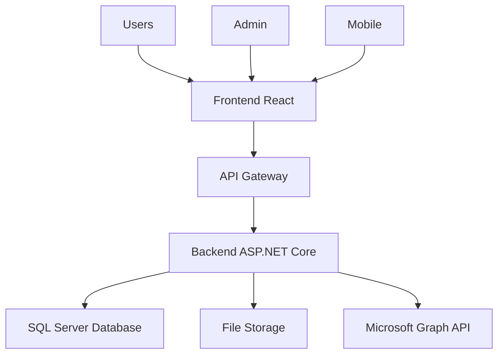

# 🏢 PortalTI - Sistema Integral de Gestión de Activos

<div align="center">


**Sistema completo de gestión de activos, tickets, usuarios y reportes empresariales**

[](https://reactjs.org/)
[](https://dotnet.microsoft.com/)
[](https://www.microsoft.com/sql-server)
[](LICENSE)

[📖 **Ver Documentación Completa**](docs/index.md) | [🚀 **Inicio Rápido**](#-inicio-rápido) | [📸 **Screenshots**](docs/screenshots.md)

</div>

---

## ✨ Características Principales

### 🎯 **Gestión de Activos**
- **Inventario completo** de equipos, móviles y dispositivos
- **Asignación automática** a usuarios con historial completo
- **Software & Seguridad** integrado con programas estándar
- **Conexión remota** y control de acceso

### 🎫 **Sistema de Tickets**
- **Creación intuitiva** de tickets de soporte
- **Seguimiento en tiempo real** con notificaciones
- **Chat interno** para comunicación directa
- **Gestión de evidencias** con imágenes y archivos

### 👥 **Gestión de Usuarios**
- **Autenticación segura** con JWT
- **Roles y permisos** granulares
- **Nómina de usuarios** integrada
- **Perfiles personalizables**

### 📊 **Reportes Avanzados**
- **Dashboard ejecutivo** con métricas clave
- **Reportes trimestrales** en Excel
- **Análisis de rendimiento** por agente
- **Tendencias y estadísticas** detalladas

### 📅 **Calendario Integrado**
- **Vista estilo Outlook** con múltiples vistas
- **Integración con Microsoft Teams**
- **Creación de reuniones** automática
- **Gestión de eventos** empresariales

---

## 🚀 Inicio Rápido

### 📋 Prerrequisitos

- **Node.js** 18+ y npm
- **.NET 9.0** SDK
- **SQL Server** 2019+
- **Git** para clonar el repositorio

### 🔧 Instalación

1. **Clonar el repositorio**
   ```bash
   git clone https://github.com/elnames/PortalTI.git
   cd PortalTI
   ```

2. **Configurar Backend**
   ```bash
   cd portalti-backend/PortalTi.Api
   dotnet restore
   dotnet ef database update
   dotnet run
   ```

3. **Configurar Frontend**
   ```bash
   npm install
   npm start
   ```

4. **Acceder al sistema**
   - Frontend: `http://localhost:3000`
   - Backend API: `http://localhost:5000`

### 🗄️ Base de Datos

Ejecuta los scripts en orden:

1. **[CREAR_BD_COMPLETA.sql](portalti-backend/PortalTi.Api/Scripts/CREAR_BD_COMPLETA.sql)** - Crear estructura completa
2. **[CREAR_ADMIN.sql](portalti-backend/PortalTi.Api/Scripts/CREAR_ADMIN.sql)** - Usuario administrador
3. **[POBLAR_BD.sql](portalti-backend/PortalTi.Api/Scripts/POBLAR_BD.sql)** - Datos de prueba

---

## 📚 Documentación

<div align="center">

| 📖 Documentación | 📝 Descripción |
|------------------|----------------|
| [🏠 **Documentación Principal**](docs/README.md) | Características y guías de instalación |
| [🔧 **Documentación Técnica**](docs/DOCUMENTACION_TECNICA.md) | Arquitectura y API para desarrolladores |
| [📸 **Galería de Screenshots**](docs/screenshots.md) | Capturas de pantalla del sistema |
| [🔒 **Políticas de Seguridad**](docs/SECURITY.md) | Medidas de seguridad implementadas |
| [🔌 **API Documentation**](docs/API.md) | Documentación completa de la API REST |
| [💾 **Almacenamiento**](docs/STORAGE.md) | Configuración y gestión de archivos |
| [📋 **TODO**](docs/TODO.md) | Lista de tareas y mejoras futuras |

</div>

---

## 🏗️ Arquitectura del Sistema



### 🎨 **Frontend (React)**
- **Componentes modulares** con Tailwind CSS
- **Context API** para estado global
- **React Router** para navegación
- **Axios** para comunicación con API

### ⚙️ **Backend (ASP.NET Core)**
- **API REST** con autenticación JWT
- **Entity Framework Core** para ORM
- **SignalR** para notificaciones en tiempo real
- **ClosedXML** para generación de Excel

### 🗄️ **Base de Datos (SQL Server)**
- **Diseño normalizado** con relaciones optimizadas
- **Índices** para consultas eficientes
- **Triggers** para auditoría automática
- **Stored Procedures** para operaciones complejas

---

## 🔧 Tecnologías Utilizadas

### Frontend
- **React 18.2.0** - Biblioteca de UI
- **Tailwind CSS** - Framework de estilos
- **Lucide React** - Iconografía
- **FullCalendar** - Componente de calendario
- **Axios** - Cliente HTTP

### Backend
- **ASP.NET Core 9.0** - Framework web
- **Entity Framework Core** - ORM
- **JWT Authentication** - Autenticación
- **SignalR** - Comunicación en tiempo real
- **ClosedXML** - Generación de Excel

### Base de Datos
- **SQL Server 2022** - Motor de base de datos
- **Entity Framework Migrations** - Control de versiones
- **Stored Procedures** - Lógica de negocio

### Integraciones
- **Microsoft Graph API** - Integración con Teams
- **RustDesk** - Control remoto
- **File System** - Almacenamiento de archivos

---

## 📊 Características Destacadas

### 🎯 **Sistema de Programas Estándar**
- **Lista predefinida** de software empresarial
- **Categorización automática** (Software, Seguridad, Licencias)
- **Verificación de instalaciones** con un clic
- **Reportes integrados** con estado real

### 📈 **Reportes Trimestrales**
- **Generación automática** en Excel
- **Dos hojas**: Workstations y Celulares
- **Datos reales** de la base de datos
- **Formato profesional** con estilos corporativos

### 🔐 **Seguridad Avanzada**
- **Autenticación JWT** con refresh tokens
- **Autorización basada en roles**
- **Auditoría completa** de acciones
- **Almacenamiento seguro** de archivos

### 💬 **Comunicación Integrada**
- **Chat interno** entre usuarios y soporte
- **Notificaciones en tiempo real**
- **Sistema de tickets** con seguimiento
- **Integración con Microsoft Teams**

---

## 🚀 Roadmap

### ✅ **Completado**
- [x] Sistema base de gestión de activos
- [x] Autenticación y autorización
- [x] Sistema de tickets completo
- [x] Reportes trimestrales
- [x] Integración con Microsoft Teams
- [x] Sistema de programas estándar

### 🔄 **En Desarrollo**
- [ ] Dashboard avanzado con métricas
- [ ] Notificaciones push
- [ ] API móvil nativa
- [ ] Integración con Active Directory

### 📋 **Planificado**
- [ ] Sistema de backup automático
- [ ] Integración con más servicios
- [ ] Mejoras de rendimiento
- [ ] Documentación de API mejorada

---

## 🤝 Contribuir

¡Las contribuciones son bienvenidas! Por favor:

1. **Fork** el proyecto
2. **Crea** una rama para tu feature (`git checkout -b feature/AmazingFeature`)
3. **Commit** tus cambios (`git commit -m 'Add some AmazingFeature'`)
4. **Push** a la rama (`git push origin feature/AmazingFeature`)
5. **Abre** un Pull Request

---

## 📞 Soporte

- **📧 Email**: [javier.rjorquera@gmail.com](mailto:javier.rjorquera@gmail.com)
- **🐛 Issues**: [GitHub Issues](https://github.com/elnames/PortalTI/issues)
- **📖 Documentación**: [Ver Documentación Completa](docs/index.md)

---

## 📄 Licencia

Este proyecto está bajo la Licencia MIT. Ver el archivo [LICENSE](LICENSE) para más detalles.

---

<div align="center">

**PortalTI** - Sistema Integral de Gestión de Activos  
*Desarrollado con ❤️ en nombre de mi homero QEPD🐶🕊️ (02/08/25)*

[⬆️ Volver arriba](#-portalti---sistema-integral-de-gestión-de-activos)

</div>
